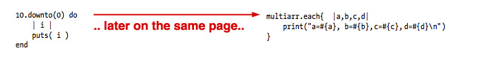
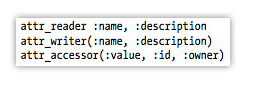
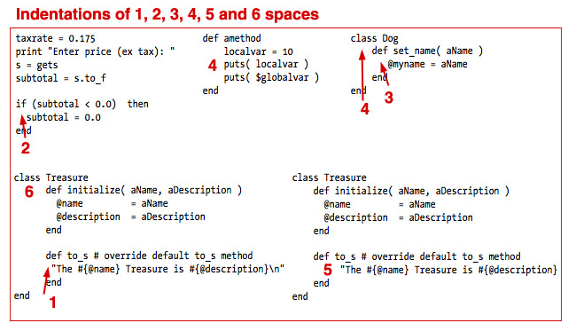
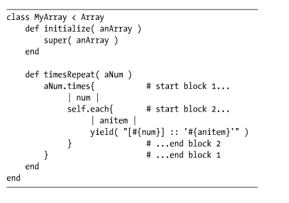
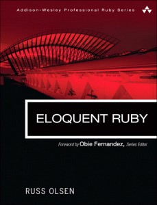

!SLIDE bullets incremental left

## 為什麼 Code 這麼容易腐敗？

!SLIDE

## <del> 其實大多數 Rails Developer 不會寫 Rails </del>

!SLIDE bullets left

# 常見的 Rails Code

* 晦澀：難以閱讀，無法了解意圖
* 不需要的重複：相同概念的程式碼被複製貼上重複使用
* 黏滯：彈性不夠，把事情做對比做錯還難
* 固定： 難以分解，讓程式再重用
* 脆弱： 一旦修改，別的無關地方也炸到
* 僵硬 : 難以修改，每改一處牽一髮動全身

!SLIDE center

# Spaghetti code

  

!SLIDE bullets left

# Spaghetti code 的成因

* Don't know how to code 
* IT JUST WORKS!
* PHP, .NET, JAVA coding tyle 
* unfamiliar with Rails way

!SLIDE bullets left

# Common Antipatterns

* 不好的程式寫作習慣
* 不適當的 Coding Style
* 隨意亂扔程式碼
* 到處複製貼上程式碼
* 濫用 Framework / ORM
* 重複發明輪子

!SLIDE

# 使用大量的縮寫
## 不好的寫作習慣

!SLIDE code left

### 無法理解

<pre>
  def t_tags
    t_list.join(" ")
  end
</pre>

### 容易理解

<pre>
  def tokenized_tags
    tag_list.join(" ")
  end
</pre>

!SLIDE

# 能夠不縮寫就不縮寫
### 真的太長的 method name ( 3個詞以上)，使用 module 或 namespace 

!SLIDE code left

# 無法了解意義的變數

## 錯誤 

  <pre>
      case game_type
      
      when "1"
        # do_something_x
      when "2"
        # do_something_y
      when "3"
        # do_something_z
      else
        # redirect_to root_path
      end
  </pre>

!SLIDE code left

## 正確

  <pre>
      case game_type
      when "rpg"
        # do_somehting_x
      when "strategy"
        # do_something_y
      when "fps"
        # do_something_y
      else
        # redirect_to root_path
      end
  </pre>

!SLIDE

# 濫用 elsif
## 不好的寫作習慣

!SLIDE code

## 邏輯混亂

<pre>
    if color=="red"
      print "red"
    elsif color="green"
      print "green"
    elsif orignal_color=="yellow"
      print "yellow"
    else
      print "orange"  
    end
</pre>

!SLIDE code

## 容易理解

<pre>
  if original_color == "yellow"
    print "yellow"
    return
  end
  
  case color
  when "red"
    print "red"
  when "green"
    print "green"
  else
    print "orange"
  end

</pre>

!SLIDE

# 語意不明
## 不好的寫作習慣

!SLIDE code

## 動詞 / 名詞 / 形容詞 傻傻搞不清楚

### 錯誤

  <pre>
  post.is_hide
  </pre>

### 正確

  <pre>
  post.is_hidden
  </pre>

!SLIDE code

## 是不是 spam ? => 疑問，回傳 true / false

  <pre>
    post.is_spam?
  </pre>

## 標記為 spam! => bang，改變狀態

  <pre>
    post.is_spam!
  </pre>

!SLIDE

# 濫用自創名詞
## 不好的寫作習慣

!SLIDE code

## 攻 / 受 ( 錯誤示範 )

  <pre>
  attacker / defender 
  </pre>

## 傳送者 / 接收者 ( 正確示範 )

  <pre>
  sender / reciever
  </pre>

!SLIDE

## 類似的 method，變數與寫法不一致
### 不好的寫作習慣

!SLIDE center

### 一下使用 block, 一下使用 lambda

  

### 類似的 method，寫法不一致

!SLIDE

# 不適當的 Coding Style

!SLIDE center

## 不一致的縮排

  

!SLIDE center

## method 使用 CamelCase

!SLIDE center

## more on...

  
## The Book of Weird Ruby
### 擁有各式各樣奇怪的 Ruby 範例

!SLIDE bullets incremental left

## 正確的 Ruby Coding Style

* Use 2 space indent, no tabs.
* Use snake_case for methods.
* Use CamelCase for classes and modules. 
* Use SCREAMING_SNAKE_CASE for other constants.

!SLIDE bullets incremental left

## 正確的 Ruby Coding Style

* 大範圍的程式碼使用 do end。1-2 行使用 lambda {}
* 定義 method 要加括號 ()。除非是宣告或 command
  - 加括號：hello(name) # 一般 method
  - 可不加括號： attr_accessible :nickname  # 宣告或 command 
  
!SLIDE center

## more on...

  
## Eloquent Ruby
### 學習寫正確的 Ruby code
  
!SLIDE

### 如果你的 code 不直觀的話，你不是在寫 Ruby code

!SLIDE

### 道德底線： Readability ( 易讀，容易了解 )
